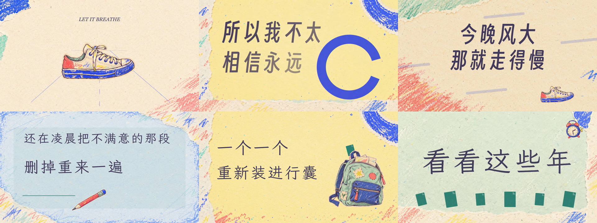

<div align="center">

[](https://hbaopiqi.github.io/bandage-mv/)

# 绷带

**鹤我这豹脾气 · 手绘拼贴文字动画 MV**

94 BPM · 03:42 · Canvas Kinetic Typography

[▶ GitHub Pages 在线播放](https://hbaopiqi.github.io/bandage-mv/)　·　[Sites 镜像](https://bandage-mv.hbaopiqi.chatgpt.site)

</div>

> 不用催，路还远。那些一圈又一圈缠上的绷带，是为了提醒自己曾经怎样一路走到这里。

## 作品简介

《绷带》写的是一个人在成长途中，学会与焦虑、失败和未愈合的伤口相处。凌晨的街、没回的消息、走得比自己更快的人，都曾让方向变得模糊。

这部网页 MV 以歌词为分镜，以鼓点和留白控制运动节奏。背包、旧帆布鞋、手机、心脏与绷带在撕纸、蜡笔和手绘线条之间反复出现；文字不只是字幕，也会成为道路、座椅、口袋和伤口。路还很长，答案可以晚一点出现，只要还愿意向前走，就还没有终点。

## 在线观看

| 入口 | 地址 | 说明 |
| --- | --- | --- |
| GitHub Pages | [打开完整 MV](https://hbaopiqi.github.io/bandage-mv/) | 本仓库自动部署 |
| Sites | [打开镜像站点](https://bandage-mv.hbaopiqi.chatgpt.site) | 独立托管镜像 |

建议佩戴耳机观看。首次点击进入后，浏览器才会开始播放音乐。电脑端可以全屏观看；手机端建议横屏。

## 画面与动效



- 歌词逐句对齐完整音频时间轴，段落与重拍触发动效变化
- 手绘、蜡笔、撕纸与拼贴素材贯穿整首歌曲
- 字号、字距、构图和运动方向跟随歌词情绪变化
- 加载首页、章节跳转、进度拖动、画面保存与全屏播放
- 适配桌面浏览器和手机横屏，支持触控播放控制

## 观看控制

| 功能 | 电脑 | 手机 |
| --- | --- | --- |
| 播放 / 暂停 | 播放按钮或空格键 | 播放按钮 |
| 前后移动 | 左右方向键或拖动进度条 | 拖动进度条 |
| 选择段落 | “翻到”菜单 | “翻到”菜单 |
| 全屏观看 | 全屏按钮 | 全屏按钮并横屏 |
| 保存画面 | “保存画面”按钮 | 长按保存生成的画面 |

## 技术实现

项目使用原生 HTML、CSS 与 JavaScript 构建，不依赖前端框架。Canvas 负责逐帧绘制文字、图形和拼贴素材；音频时间作为唯一主时钟，驱动歌词、转场和场景动画。全部字体、歌词时间轴与视觉素材随仓库一同发布。

```text
dist/
├─ index.html              网站入口与播放器结构
├─ styles.css              页面、加载页与移动端适配
├─ loading.js              资源预载与进入流程
├─ player.js               音频控制和时间轴驱动
├─ art.js                  逐幕动画与文字排版
├─ collage.js              拼贴素材调度
└─ assets/                 音频、歌词、字体与画面素材
```

## 本地运行

```bash
python -m http.server 8768 --directory dist
```

打开 <http://127.0.0.1:8768/> 即可观看。项目不需要后端，也不需要安装依赖。


